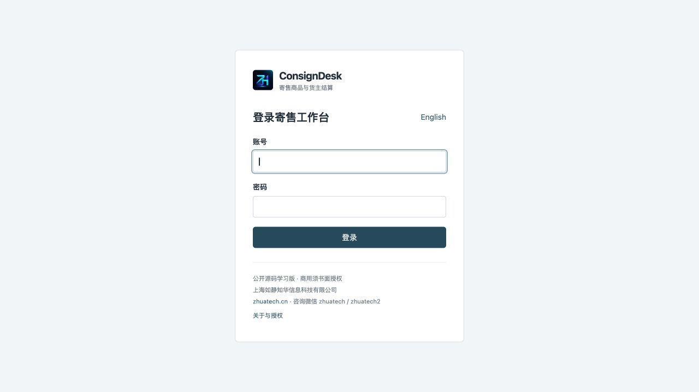
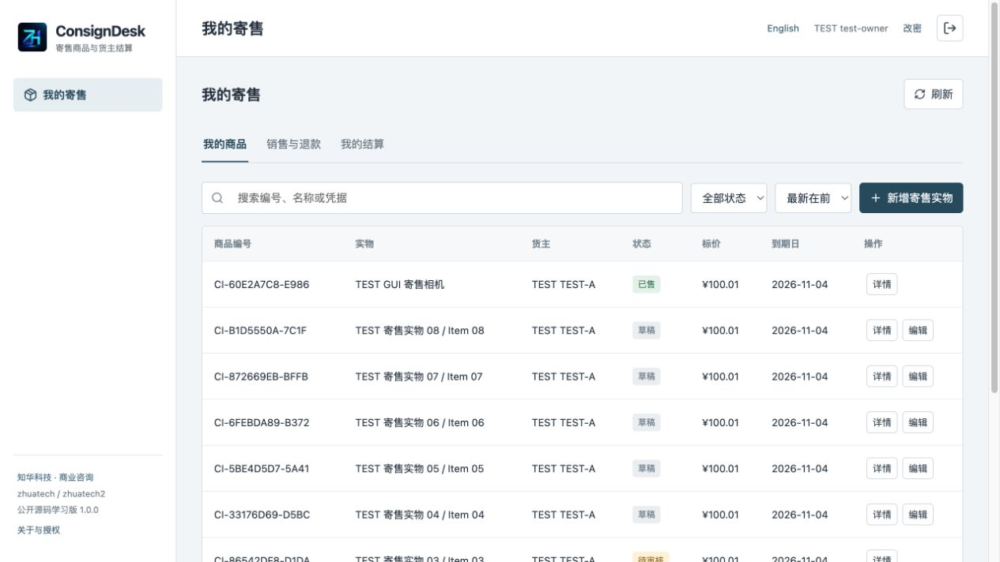
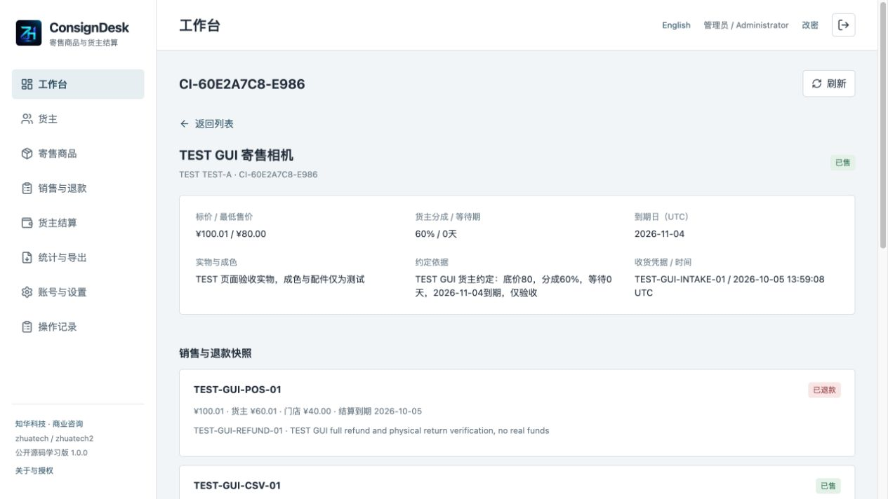
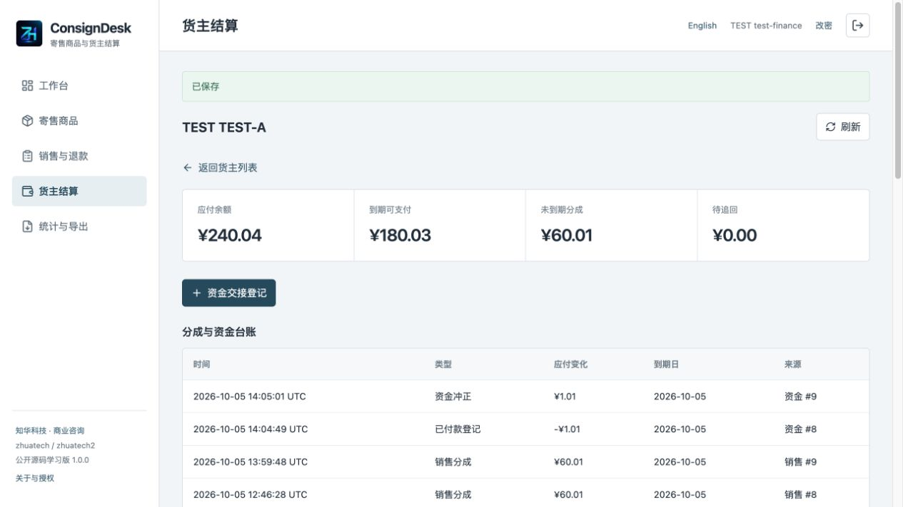
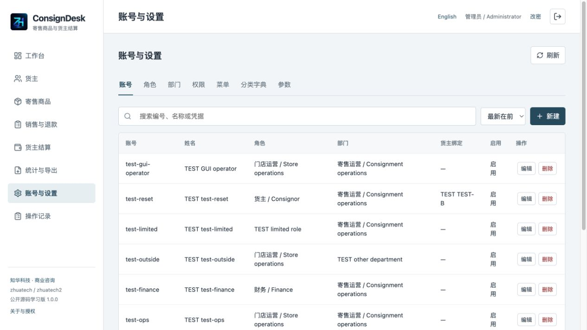
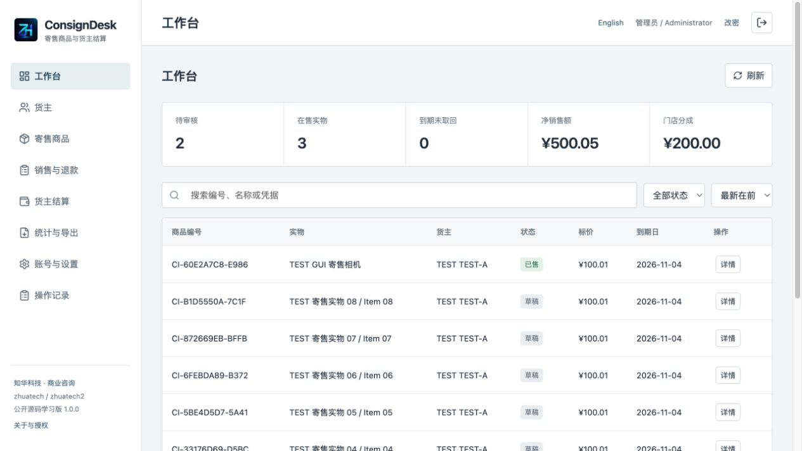
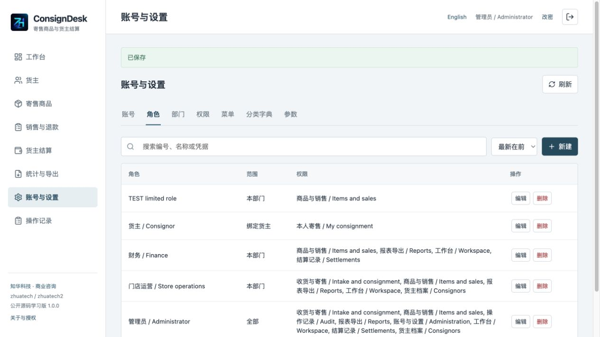
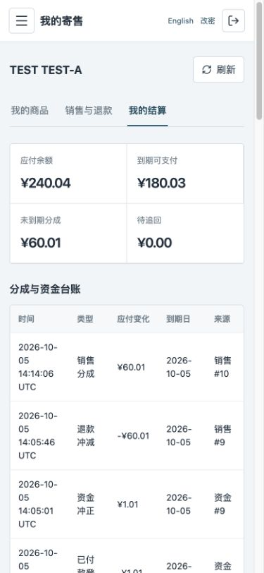

[中文](README.md) | [English](README.en.md)

<p></p>

# ConsignDesk · 知华寄售商品与货主结算

**1.0.0 · 公开源码学习版／非商业源码版。未经书面授权不得商用。**

知华科技（上海如静知华信息科技有限公司） · [官网](https://www.zhuatech.cn/) · 商业咨询微信 **zhuatech / zhuatech2**。

寄售门店收的是货主的实物，销售后按约定分成。ConsignDesk 将货主申请、独立审核、收货上架、销售凭据、退款、到期取回和货主结算放在同一份可核对记录里，适合二手服饰、收藏品及家居寄售门店和为其实施软件的团队。基于 Java 21／Spring Boot、Vue 3、MySQL 和 Flyway，提供中文 / English 界面与独立私有部署。

## 一件实物从进店到结算

1. 门店建立货主档案和账号。货主在本人入口填写商品、成色、标价、最低售价、分成比例、销售后结算等待天数和到期日，保存草稿后提交。
2. 其他工作人员核实线下约定，批准或退回修改；作者不能自己批准。批准只是约定通过，尚未代表门店收到商品。
3. 员工核验实物，填写收货凭据和说明，才变为在售。**每个编号代表一件实物**，不支持批量件数、共享SKU或多仓调拨。
4. 门店登记已经发生的外部POS或人工销售凭据。实际售价不能低于冻结底价，到期商品须核实续期后才能销售。销售保存分成比例、实际价格、货主应得和等待期快照。
5. 财务登记实际线下付款，可分次但不能超过到期可支付余额。同一凭据不能重复。退款按原销售全额冲减分成并记录实物归还；若货主已经收款，余额会显示待追回，不能隐藏负数或再次付款。
6. 未售实物可登记取回；已销售的实物不能直接取回。续期只延长期限，不能改写冻结的底价、分成和等待期。资金录错须登记已有外部冲正凭据，以新增反向记录保留原账。

销售、付款、退款、追回均是**人工登记外部事实**，不会连接银行、扣款、发起退款或发送消息。分成按实际销售额乘货主比例，四舍五入至两位小数，尾差归门店；货主分成与门店分成严格合计销售额。系统不确认物品真伪、合同法律效力或款项是否实际到账。

## 页面与岗位

货主只能查看自己的实物、销售与退款、分成台账和资金记录。门店运营维护本部门货主、处理寄售与销售；财务处理本部门结算；管理员负责账号、部门和权限。接口在每次请求重新核对实际账号与范围，不能靠隐藏菜单防越权。

| 登录                                       | 货主商品                                  |
| ------------------------------------------ | ----------------------------------------- |
|         |   |
| 收货与商品详情                             | 货主结算                                  |
|      |  |
| 账号管理                                   | 工作台统计                                |
|  |    |
| 角色权限                                   | 手机业务端                                |
|     |       |

- 登录：以实际账号进入授权工作空间。
- 货主商品：仅查看与维护本人寄售实物。
- 商品详情：查看冻结约定、收货、销售和状态历史。
- 货主结算：核对有符号余额、未到期分成、可付款额和资金流水。
- 账号管理：配置部门、角色、货主绑定和启用状态。
- 工作台统计：汇总授权范围内状态、净销售及门店分成。
- 角色权限：维护接口权限与数据范围。
- 手机业务端：在窄屏布局中处理本人商品与台账。

## 能力和边界

| 模块       | 实现内容                                                                                     |
| ---------- | -------------------------------------------------------------------------------------------- |
| 货主       | 档案CRUD、部门、启停、版本、引用保护、独立登录绑定                                           |
| 寄售实物   | 本人草稿、提交/撤回、独立审核/退回、实际收货、冻结约定、期限续期、未售取回、取消、状态历史   |
| 销售与退货 | 单件实物销售、唯一外部凭据、底价/期限校验、分成快照、原销售全额退款及实物归还、再次销售      |
| 货主结算   | 有符号应付余额、未到期分成、到期可付款额、分次付款、待追回、追回登记、单次冲正、不可覆盖台账 |
| 批量与报表 | 最多300笔原子销售导入、CSV校验与预览、商品/销售/台账CSV、状态统计、净销售及门店分成          |
| 后台       | 账号、角色、部门、权限、菜单、字典和参数；货主绑定不可转换；最后管理员保护                   |
| 通用       | 会话认证、BCrypt、CSRF、改密、实时权限、审计、搜索/状态筛选/排序/每页10条、健康与迁移        |

**未实现：** 自动POS同步、在线收付款、部分退款、税额发票、银行对账、自动鉴定、电子签名、图片附件、条码生成和标签打印、邮件短信、货主公开注册、买断货品、柜位租赁、自动降价、店内储值、跨公司多租户及SaaS订阅。等待期是双方约定的台账规则，不承诺满足任一地区法律。分成记录不是税务发票或总账。

核心业务没有第三方密钥依赖。销售CSV可用于人工对接既有POS，不能称为自动集成。正式HTTPS证书和外部MySQL由部署方配置，其他接口须额外开发。

## 启动自己的实例

环境：Python 3、Java **21**、Maven **3.9**、Node **24.19.0+**、MySQL **8.4**、Docker及Compose v2。后端 Spring Boot **4.0.7** / Spring Security / JPA / Flyway；前端 Vue **3.5.40** / Vite **8.1.5**；MariaDB Java Client **3.5.10** 连接 MySQL 8.4（`jdbc:mariadb://`）。

```sh
python3 scripts/init-env.py
# 首次管理员口令在私有 .env 中；禁止上传
# 端口占用时，在 .env 设置另一个 WEB_PORT，不停止其他项目
docker compose config --quiet
docker compose up -d --build --wait
```

默认 [http://localhost:8120/](http://localhost:8120/)，健康 [http://localhost:8120/actuator/health](http://localhost:8120/actuator/health)。首次用户名`admin`，口令是`.env`中的`ADMIN_PASSWORD`，没有公共演示密码。初始化脚本生成独立随机密码，文件权限0600，拒绝覆盖已有`.env`；重启不会重置口令。

首次空库创建管理员、4个角色、9个权限、9个菜单、基础部门、3个分类和3个参数。**不创建货主、商品、销售、付款或其他账号**。验收脚本使用独立TEST资料，不构成客户案例，不随正式空库初始化。

| 环境变量                        | 内容                                          |
| ------------------------------- | --------------------------------------------- |
| MYSQL_ROOT_PASSWORD             | 唯一强数据库管理密码                          |
| DATABASE_PASSWORD               | 独立应用数据库密码                            |
| ADMIN_USERNAME / ADMIN_PASSWORD | 初始化账号及12–72字节含大小写字母和数字的口令 |
| WEB_PORT / BIND_ADDRESS         | 默认8120 / 127.0.0.1；支持端口覆盖            |
| COOKIE_SECURE                   | 本机HTTP false；正式HTTPS true                |
| DATABASE_URL / DATABASE_USER    | 可选外部MySQL；需配置verify-full和可信CA      |

[.env.example](.env.example)只含配置名，不含密码。数据库没有主机端口；Nginx同源转发`/api`，前端不写死后端主机。分别开发时先`docker compose up -d mysql --wait`，安全注入可达MySQL的`DATABASE_URL`、`DATABASE_USER`、`DATABASE_PASSWORD`和管理员初始化环境变量，再`mvn -f backend/pom.xml spring-boot:run`；`cd frontend && npm ci --no-audit --no-fund && npm run dev`，Vite默认5173代理8080。数据库默认不暴露宿主端口，宿主后端需独立开发数据库或私有回环端口映射；不要连接实际业务库做验收。

## 工程、数据及升级

```text
backend/src/main/java/cn/zhuatech/consigndesk/     权限、管理、实物状态和结算事务
backend/src/main/resources/db/migration/         版本化表结构
backend/src/test/                               HTTP/JPA与业务规则回归
frontend/src/                                  员工端、货主端、管理端和双语显示
scripts/                                       口令初始化、全新库验收、发布扫描
frontend/public/brand/ + docs/images/            正式LOGO及原二维码
docs/                                          操作、接口、架构、部署及安全
compose.yaml                                   MySQL、Java、Vue Nginx
```

15张应用表，另有Flyway历史表；[V1迁移](backend/src/main/resources/db/migration/V1__consignment_schema.sql)提供完整建表、外键、索引、凭据唯一约束及金额约束。金额使用服务端BigDecimal；整数主键、版本和等待天数拒绝小数截断。商品和货主写入有版本校验，业务写入在READ_COMMITTED事务中锁定基础部门，序列化余额、状态和配置检查。适合单实例小型门店，不是海量分布式商城。

列表按权限过滤后在客户端搜索排序分页，单类列表最多10000条。不能无限增长或称为服务器海量分页。币种是实例级参数，建立商品后锁定，只接受两位小数ISO币种。期限和等待期按UTC日期，不采用浏览器本地午夜；记录时间为UTC。

迁移由Flyway管理，JPA只验证结构。不改写已执行V1；先在独立新卷恢复备份、验证登录和余额，再新增V2。详见[数据库与架构](docs/architecture.md)、[部署与恢复](docs/deployment.md)。

## 验证与故障处理

```sh
mvn -B -f backend/pom.xml spotless:check test package
cd frontend
npm ci --no-audit --no-fund
npm run format:check
npm run lint
npm test
npm run build
cd ..
docker compose config --quiet
docker compose build
python3 scripts/release-check.py
git diff --check
```

H2的HTTP/JPA回归不替代真实MySQL空卷验收，Docker Maven不跳过测试。仅对全新可丢弃测试实例执行`TEST_URL=http://127.0.0.1:8120 python3 scripts/smoke-test.py`，不能用于已有业务库。详见[测试](docs/testing.md)。在完成测试和页面操作后，使用 `python3 scripts/persistence-check.py --capture` 保存被忽略的私有响应快照；重启或独立恢复后，通过 `TEST_URL` 指向对应环境，不加 `--capture` 运行同脚本比较原账号、商品、销售和资金台账。

- 无法启动：核对环境变量、端口和三容器健康；查看本实例日志，不删其他项目数据。
- 货主无法进入：核对绑定、同部门、角色CONSIGNOR范围及仅portal权限、货主启用状态。
- 作者无法批准：换另一位有本部门运营权限的员工审核，不能解除独立审核规则。
- 上架不能销售：核对到期日、冻结最低售价、版本及货主启用状态。
- 无可付款额：检查等待期、已付款、退款及待追回负余额；未到期销售不能提前付。
- CSV失败：下载当前商品模板，填实际外部凭据，不改版本；重复、过期或错误行整批回滚，不逐行重试。
- 版本冲突：刷新并核对变更再重做，不自动覆盖别人的内容。被引用的档案与已提交历史不能物理删除。

操作见[手册](docs/manual.md)，接口见[API](docs/api.md)。

## 安全、反馈与贡献

使用HTTPS、内网或可信入口，限制访问、维护强密码及最小权限、定期备份并验证恢复。CSRF和HttpOnly会话Cookie不代替部署安全；登录失败有单实例窗口限制，不提供跨节点限流、MFA或SSO。不得在联系备注、依据或导入中放银行密码、卡号、身份证及其他不必要敏感资料。版本并发和完整安全边界见[安全](docs/security.md)。

贡献须附完整复现和验证，禁止提交客户资料、私有环境文件、口令及数据库。问题反馈请提供脱敏步骤、预期和实际结果；安全漏洞请通过官网或咨询微信私下报告，不公开凭证或利用载荷。软件按现状提供，不作支付、鉴定、法律、税务或合规保证。部署方须独立验收自身业务与第三方依赖。

## 授权与联系知华科技

自有源码限个人学习、技术研究和非商业交流，版权属于上海如静知华信息科技有限公司；以根目录[LICENSE](LICENSE)为准，不是OSI标准开源许可证。Vue、Lucide等第三方保留自身版权与许可，详见[第三方声明](docs/third-party.md)，品牌文案不改变其许可。

本项目由知华科技（上海如静知华信息科技有限公司）提供公开源码学习版本，主要用于个人学习、技术研究与非商业交流。未经书面授权不得商用。企业信息化建设、中小企业数字化转型、中小企业 AI 转型、私有化部署、软件外包、软件项目外包、软件实施、FDE 外包、OPC 技术支持及深度定制开发，请访问[知华科技官网](https://www.zhuatech.cn/)，或添加微信 zhuatech、zhuatech2 咨询。

服务范围：商业源码授权、私有部署、POS接口适配、历史数据迁移、业务规则定制与系统集成。商业部署、为客户交付、二次销售及SaaS经营须取得对应书面授权；不默认转让版权。

<table><tr><td align="center"><br>微信：zhuatech</td><td align="center"><br>微信：zhuatech2</td></tr></table>

商业授权或深度定制开发请联系知华科技。
